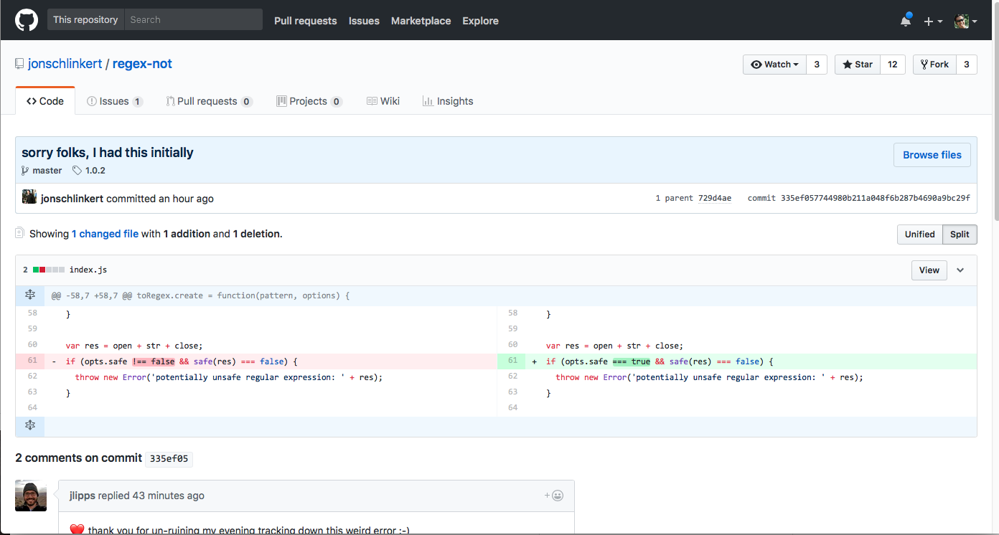
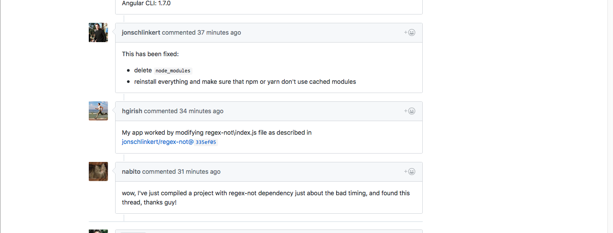

# Simple BlockChain and CryptoCurrency Example

February 16 2018

This repository is my recent exploration into describing how blockchain works.

The template for this project is a Node 9.x / Express 4.x setup .

Note: When this example was created there was (literally) last minute
changes being made to the regex-not package that affected the compilation
of this project (see https://github.com/parcel-bundler/parcel/issues/858
and [this commit](https://github.com/jonschlinkert/regex-not/commit/335ef057744980b211a048f6b287b4690a9bc29f) )

